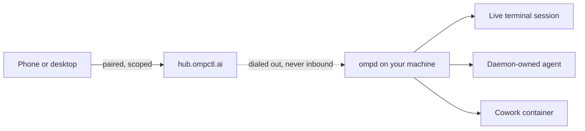

# ompctl

**Your agents keep running. You stop having to sit there.**

A control plane for [OMP](https://github.com/can1357/oh-my-pi) coding agents. A daemon runs on your machine. Your phone pairs with it and drives the sessions already running there.

[ompctl.ai](https://ompctl.ai)

---

## The problem

You start an agent on a real task. It runs for forty minutes. Somewhere in the middle it needs one sentence from you, or it finishes and sits there waiting to be told what is next.

So you sit there too. At a desk. Watching a terminal do something you already decided.

Volume stopped being the constraint the moment agents got good. Judgement is the whole game now, and judgement does not need a chair.

## What it does

ompctl puts the sessions already running on your machine onto whatever device you are holding.

- **See every session.** Live terminals, daemon-owned agents, dormant transcripts. What each one is doing, which model it is on, what it has cost.
- **Open one and talk to it.** Including a session you started yourself in a terminal, which keeps rendering exactly where it is while your message lands in it.
- **Answer the thing that is blocking it.** Approvals, plan reviews, elicitations. The decision, not the transcript.
- **Say it out loud.** Dictate into a session and hear the reply read back, on device, no cloud speech.
- **Start work without you.** Routines run on a schedule or a webhook and hand you sessions to look at afterward.
- **From anywhere.** Your laptop is behind NAT and asleep half the time. The daemon dials out, so no port forwarding, no VPN, no static IP.

## Quickstart

Four commands and a code.

```sh
# on the machine your agents run on
ompd self-install
ompd start
ompd invite "my phone" --scopes read,prompt
ompd doctor
```

`invite` pairs and approves in one step, printing a token and a QR code. Point the app at either. If you would rather approve the device by hand, `ompd pair` begins the same flow and prints a code to approve instead.

## A device gets exactly what you gave it

Pairing is a capability, not a login. Four scopes, granted per device, revocable from the machine at any time.

| Scope | What it permits |
|---|---|
| `read` | See sessions, transcripts, agents, cost |
| `prompt` | Send messages into a session |
| `approve` | Answer approvals and plan reviews |
| `manage` | Provision hosts, change settings, create agents |

A read-only phone stays read-only. `ompd devices` lists what is paired, `ompd revoke` ends it, `ompd rotate` re-mints it, and `ompd audit` shows every action any device took.

## Routines

An agent that only runs when you are watching is a tool. One that runs on its own is staff.

```sh
ompd routines
```

Routines are triggers plus an ordered set of prompts. Each action starts a fresh agent in its own working directory, and every run keeps the sessions it created, so a routine's history is a list of real sessions you can open and read rather than a status row that says "ok".

Schedule them, or fire them from a webhook with a rotatable secret. They are also exposed as MCP tools, so an agent can create and manage them for you.

## Every screen, both surfaces

The same application, a phone and a desktop apart.

```sh
cd packages/app
bun run ios       # or android, macos, windows, web
```

Five platforms from one codebase. The web build is what [app.ompctl.ai](https://app.ompctl.ai) serves.

## How it fits together



The daemon binds loopback by default. Reaching it from elsewhere is a deliberate act: either bind it to your LAN, or let it dial the hub, which is a relay that carries an already-encrypted, already-authorized channel and holds no credential of yours.

## What is not here yet

Stated plainly, because a README that only lists wins is a sales page.

- **No push notifications.** Nothing can tell you a decision is waiting. You have to open the app. This is the biggest gap.
- **No true co-drive.** A phone and a terminal cannot both hold one session at once. Steering a live terminal works; sharing it does not, and it waits on upstream OMP collab.
- **Model is visible, not settable.** Every control frame is keyed to a daemon-owned agent, and a terminal session has none.
- **Artifacts render as text.** Images, video, diffs and HTML that a session produces are on their way, not landed.

## Repository

| Package | What it is |
|---|---|
| `packages/daemon` | The daemon: sessions, agents, hosts, routines, voice, gateway |
| `packages/app` | The client, on iOS, Android, macOS, Windows and web |
| `packages/hub` | The relay that lets a phone reach a machine behind NAT |
| `packages/cli` | `ompd`, and the MCP server agents use to drive it |
| `packages/core` | The wire contract both ends compile against |
| `packages/acp` | ACP client and the bridge to OMP |
| `packages/omp-extension` | The extension that registers a live terminal session |
| `packages/tunnel` | Byte plumbing shared by the daemon, the hub and every client |
| `packages/e2e` | Cucumber features that drive the real thing |
| `packages/site` | [ompctl.ai](https://ompctl.ai) |

## Building

```sh
bun install
bun run check    # types and formatting
bun run test     # the suite
bun run build:cli
```

Requires [Bun](https://bun.sh) and a working `omp` on your PATH.

## License

Not yet licensed. The repository is public to read; no license grant has been
published, so all rights are reserved by default until one is added.
