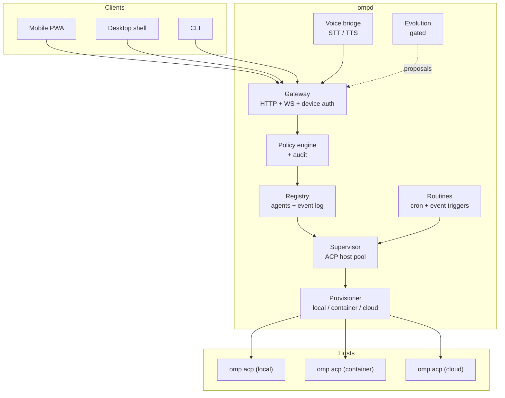
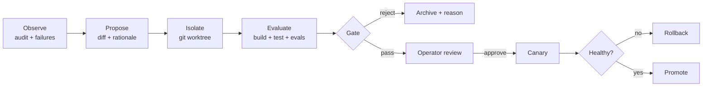

# ompd architecture

## The actual gap

OMP already has far more than it looks like. Everything below was verified against
the shipped `omp` 17.2.12 binary before any code was written.

| Capability             | Already in OMP                                                                                                                                           | Genuinely missing                                                                       |
| ---------------------- | ---------------------------------------------------------------------------------------------------------------------------------------------------------- | ------------------------------------------------------------------------------------------ |
| Remote control         | `/collab` + `collab-web`: E2E relay, browser guest, prompt/interrupt, subagent hub                                                                        | Host-initiated and ephemeral. No agent that outlives its terminal, no push, no installable client |
| Routines               | nothing                                                                                                                                                   | everything                                                                                  |
| Local / cloud sessions | ACP `session/new`, `session/list`, `session/fork`, `session/resume`, `session/close`                                                                      | Process lifetime is still tied to the parent. No provisioning of any kind                   |
| Bi-directional voice   | `/live` realtime (OpenAI `gpt-realtime`, semantic VAD, interruptible), local Parakeet STT, `speech.*` output, native `AudioCapture`/`AudioPlayback`/`LiveWebRtcPeer` | All bound to the local TUI. Nothing carries voice over a network                            |
| Cowork equivalent      | `collab-web` guest viewer                                                                                                                                 | Multi-agent shell, approvals UI, task inbox, installable                                    |
| Self-improvement       | extensions, hooks, managed skills, memory, advisor                                                                                                        | A gated propose → isolate → evaluate → promote loop                                         |

Reduced to one sentence: **OMP is terminal-first and has no control plane.** All six
asks are symptoms of that, so `ompd` is one system, not six features.

Two consequences worth stating plainly, because both cut real work:

- **Voice is a transport problem, not a synthesis problem.** OMP's STT/TTS/realtime
  stack already works locally. Do not reimplement it.
- **ACP already covers most of the agent-facing layer.** See below.

## Why ACP, not RPC

OMP exposes two programmatic surfaces. The choice between them is load-bearing, so
it was settled by experiment rather than by reading.

| | `omp --mode rpc` | `omp acp` |
| --- | --- | --- |
| Tool approvals | `set_host_tools` only covers host-owned callbacks. Built-in `bash`/`edit`/`write` execute inside the child | **`session/request_permission` fires for built-in tools**, with `allow_once` / `allow_always` / `reject_once` / `reject_always` |
| Sessions per process | one | many (`session/new`, `list`, `fork`, `resume`, `close`) |
| Session registry | none | `session/list` returns machine-wide sessions with cwd, title, `updatedAt`, message count |
| Modes | n/a | `configOptions` (default, plan, …) |
| Subagent introspection | yes | no |
| Audio content blocks | no | no (`promptCapabilities` = `embeddedContext`, `image`) |

Verified against the live binary:

1. Prompting an ACP session to run `touch /tmp/<marker>` emitted
   `session/request_permission` for the **built-in bash tool**.
2. Answering `reject_once` meant the marker file **was never created**.
3. `session/list` returned 50 real sessions across the machine.

That settles it. ACP is the agent-facing transport, because it is the only one that
can enforce approvals on built-in tools, the single most important property for a
control plane reachable from a phone. RPC remains available as an optional sidecar
if subagent introspection is later wanted; it is not in the foundation.

A second, welcome consequence: one `omp acp` process hosts many sessions, so the
daemon runs a small pool rather than a process per agent.

## Shape



The inversion that unlocks everything: **agent lifetime is owned by the daemon, not
by a client connection.** A phone losing signal must not kill a build.

## Packages

| Package        | Responsibility                                                              |
| -------------- | ----------------------------------------------------------------------------- |
| `@ompd/acp`    | ACP client: JSON-RPC framing, request correlation, permission callback wiring |
| `@ompd/core`   | Contracts, SQLite store, policy engine, audit. No network I/O                 |
| `@ompd/daemon` | Supervisor, registry, gateway, routines, provisioner, voice, evolution        |
| `@ompd/cli`    | `ompd` command: daemon control, agents, routines, device pairing              |
| `@ompd/web`    | Installable PWA: agent list, transcript, approvals, voice                     |

## Contracts

Fixed up front so slices build concurrently without negotiation. Canonical
TypeScript lives in `packages/core/src/contracts.ts`; it wins over this prose.

### Agent

```ts
type AgentId = string; // "agt_" + 16 hex

type AgentState =
  | "provisioning" | "starting" | "idle" | "busy"
  | "waiting"      // blocked on an approval
  | "stopped" | "failed";

interface Agent {
  id: AgentId;
  name: string;
  state: AgentState;
  acpSessionId: string;   // OMP-side ACP session
  host: HostRef;          // which acp host process serves it
  cwd: string;
  createdAt: string;
  lastActiveAt: string;
  routineId?: string;
  labels: Record<string, string>;
}
```

### Host

An `omp acp` process. Serves many agents. The provisioner creates and tears them
down; the supervisor speaks ACP to them.

```ts
type HostKind = "local" | "container" | "cloud";

interface HostSpec {
  kind: HostKind;
  image?: string;
  repo?: string;
  ref?: string;
  ttlSeconds?: number;   // JIT hosts self-destruct
}

interface HostRef {
  kind: HostKind;
  id: string;            // pid | container id | machine id
  spec: HostSpec;
}
```

Every host is a duplex byte stream carrying ACP JSON-RPC. Local is a pipe,
container is `exec -i`, cloud is a tunnelled socket. The supervisor is
transport-agnostic by construction.

### Client wire protocol

One WebSocket at `/v1/socket`; a client may attach to many agents over it.

```ts
type ClientFrame =
  | { t: "attach"; agentId: AgentId; sinceSeq?: number }
  | { t: "detach"; agentId: AgentId }
  | { t: "prompt"; agentId: AgentId; text: string; images?: string[] }
  | { t: "cancel"; agentId: AgentId }
  | { t: "decide"; agentId: AgentId; requestId: string; choice: "allow" | "deny"; scope?: "once" | "always" }
  | { t: "audio"; agentId: AgentId; pcm: string }  // base64 16k mono PCM16
  | { t: "audio_end"; agentId: AgentId }
  | { t: "ping" };

type ServerFrame =
  | { t: "hello"; deviceId: string; agents: Agent[] }
  | { t: "agents"; agents: Agent[] }
  | { t: "update"; agentId: AgentId; seq: number; update: unknown }  // ACP session/update
  | { t: "approval"; agentId: AgentId; requestId: string; toolCall: unknown; options: unknown[] }
  | { t: "speech"; agentId: AgentId; pcm: string }
  | { t: "transcript"; agentId: AgentId; text: string; final: boolean }
  | { t: "error"; agentId?: AgentId; message: string; code?: string }
  | { t: "pong" };
```

`seq` is a monotonic per-agent counter. `attach` with `sinceSeq` replays from the
store, so a phone that dropped mid-turn resumes without gaps. That is the whole
reason updates are persisted rather than merely forwarded.

### Approval: the one rule that must not bend

`session/request_permission` is an **enforcement hook, not a policy**. A remote
`decide` frame is *evidence for* a decision, never the decision itself.

```
omp acp ──session/request_permission──▶ supervisor
                                          │
                                          ▼
                                   Policy.evaluate({agent, tool, input, actor})
                                    │              │             │
                                 "deny"         "allow"       "prompt"
                                    │              │             │
                                    │              │             ▼
                                    │              │      ask paired device
                                    │              │             │
                                    ▼              ▼             ▼
                                 reject_once   allow_once   map reply
                                          │
                                          ▼
                                    append to `audit`
```

The daemon MUST NOT forward a client's choice straight to OMP. A client that is
compromised, stale, or simply not authorised for that scope has its reply
overridden by policy. Every decision, its actor, rule, and outcome, is appended
to `audit`.

```ts
interface PolicyDecision { action: "allow" | "deny" | "prompt"; reason: string; rule?: string; }

interface Policy {
  evaluate(ctx: {
    agent: Agent;
    tool: string;
    input: unknown;
    actor: { deviceId: string; scopes: string[] };
  }): PolicyDecision;
}
```

### Store

SQLite (WAL) at `~/.ompd/ompd.db`; the daemon is the only writer.

| Table       | Purpose                                                        |
| ----------- | ---------------------------------------------------------------- |
| `agents`    | `Agent` records                                                |
| `updates`   | `(agent_id, seq, ts, payload)` append-only, for replay         |
| `routines`  | routine definitions                                            |
| `runs`      | one row per routine execution                                  |
| `devices`   | paired clients: id, name, public key, scopes, `revoked_at`     |
| `auth_tokens` | issued credentials: `sha256(token)` bound to a device, with `last_used_at` and `revoked_at` |
| `approvals` | pending and resolved approvals with decision, actor, and rule  |
| `proposals` | evolution proposals and verdicts                               |
| `audit`     | append-only record of every privileged action                  |

## Security

The daemon executes arbitrary code as the operator. It is treated accordingly.

- Binds `127.0.0.1`. Remote reach is a separate, explicit act.
- Remote reach is opt-in and never auto-started. A private overlay (Tailscale)
  is the recommended path; a public tunnel is a deliberate downgrade and is
  documented as one. See `docs/running.md`.
- A launch agent never names a path inside a checkout. `install` resolves an
  installed binary and refuses a source tree, because launchd holds that path
  across every login and a linked worktree does not survive its branch.
- The daemon holds a macOS idle-sleep assertion while an agent is working and
  releases it when the last one settles, so a turn started remotely is not
  killed by the machine going idle. It cannot wake a sleeping machine.
- Device pairing: device presents a public key, operator approves once, daemon
  issues a scoped token. Per-device revocation, no shared secret.
- Tokens are durable and only their SHA-256 hash is stored, so a pairing
  survives a restart and a stolen database yields nothing presentable. They do
  not expire; they end when a device is revoked or a token is rotated, and
  revoking a device withdraws its tokens in the same transaction.
- Approvals are decided daemon-side, per the rule above.
- Every privileged action lands in `audit` with actor and outcome.
- Hosts run under a gate configuration ompd owns and passes as a `--config`
  overlay, never inherited from the user's environment. omp has two approval
  gates and the intuitive flag arms the wrong one; the working combination is
  `approvalMode: always-ask` plus per-tool `approval: allow`. A machine whose
  global config says `yolo` would otherwise get a host that never asks at all.
  See [the approval gate](./acp-approval-gate.md) -- read it before changing
  anything in this area.

## Evolution: the constraint that makes it safe

A self-improving control plane that can rewrite its own safety rules has none.



Invariants:

1. A proposal is a **diff**, never a live mutation.
2. Evaluation runs in an isolated worktree, never the running tree.
3. `PROTECTED_PATHS`, meaning auth, policy, provisioning, audit, and the gate
   itself, are rejected at proposal time and archived with a reason.
4. Promotion requires an operator decision. There is deliberately no auto-promote
   setting, because such a setting is itself a way to remove the gate.
5. Every promotion is a commit with a revert. Rollback is `git revert`.

## Build order

Dependency-driven.

1. **Foundation**: `@ompd/acp`, `@ompd/core`, supervisor + registry.
2. **Gateway**: HTTP/WS, pairing, policy wiring, replay.
3. **Routines** and **Provisioner**, independent of each other.
4. **Web client**, against the frozen wire protocol.
5. **Voice bridge**, transporting OMP's existing stack over the gateway.
6. **Evolution**, last; it consumes the audit log the others produce.
