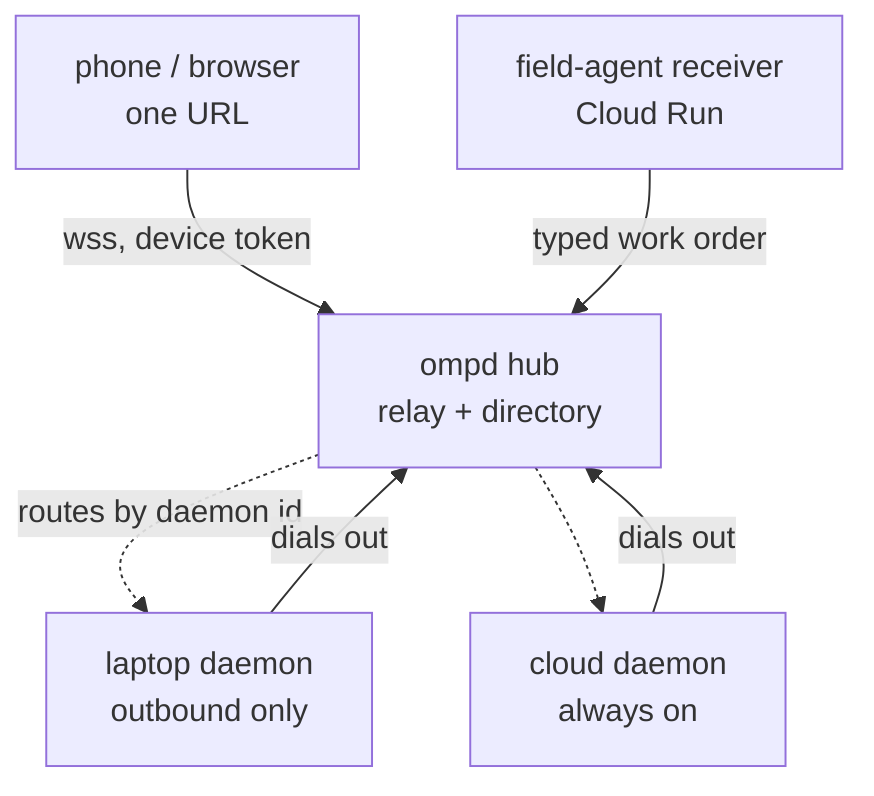

# Fleet: many daemons, one front door

Everything shipped so far assumes one daemon on one machine, reached over
loopback. The actual target is a fleet:

- the laptop at home is a daemon, behind NAT, asleep half the time
- one or more cloud daemons, always on
- one secure URL that reaches all of them from a phone, on the go
- text or voice against any of them
- routines that run **where they were configured to run**, not wherever the
  phone happens to be pointing
- `field-agent` dispatching real work from something said out loud

This document is the design for that. It is not built yet. It exists so the
shape is agreed before code, because three of the decisions below are difficult
to reverse.

## The problem with what exists

`ompd` today binds `127.0.0.1` and the only remote story is a tunnel per
machine. That fails the actual requirement in four ways:

1. **A tunnel per daemon is a URL per daemon.** The requirement is one.
2. **The laptop is behind NAT and often asleep.** Nothing inbound reaches it.
3. **A tunnel is a hole, not an identity.** Cloudflare Access in front of a
   hostname authenticates a person, but the daemon still has no idea which of
   several machines a request was meant for.
4. **Routine placement has nowhere to live.** `Routine` has no concept of which
   machine owns it, so "run this one in the cloud" cannot be expressed.

## Shape



**Daemons dial out.** The laptop opens a persistent authenticated WSS
connection to the hub and keeps it. No inbound port, no per-machine tunnel,
nothing to configure on the home router, and it survives a changing IP. A cloud
daemon does the same thing for uniformity even though it could accept inbound.

**The hub is a relay and a directory, not a brain.** It knows which daemons are
enrolled, which are currently connected, and how to move frames between a
client and a daemon. It does not execute agents, does not hold model
credentials, and should not be able to read session content. OMP's own
`/collab` already demonstrates this exact topology with AES-256-GCM between
participants and a content-blind relay that sees only ciphertext and a routing
prefix, and that is the model to follow rather than invent.

**Execution stays at the edge.** This is the load-bearing choice. A routine
placed on the cloud daemon is scheduled and executed by that daemon, using the
scheduler that already exists. The hub is not in the execution path, so a hub
outage delays your ability to *watch* a routine, not its ability to *run*. The
alternative, a central scheduler that dispatches, makes the hub a single point
of failure for every machine at once.

## Identity

Three kinds, and conflating any two of them is how this gets insecure.

| | What it is | Authenticates with |
| --- | --- | --- |
| Account | the human, the tenant | the hub |
| Daemon | one machine running ompd | an enrollment credential, to the hub |
| Device | a phone, a browser, a CLI | a scoped token, per the existing `auth_tokens` |

A device is paired to the account, then authorized per daemon. "My phone may
prompt the laptop but only read the cloud box" has to be expressible, because
the whole point of separating them is that they are not equally trusted.

Enrollment is deliberately awkward: `ompd enroll` prints a code, the operator
approves it from an already-trusted device. Same two-step as device pairing,
same reason. A daemon that can enroll itself is a daemon anyone can add.

## Routine placement

`Routine` gains `runsOn: DaemonId`, and it is required rather than defaulted.
A routine whose placement is implicit runs somewhere surprising the first time
the fleet changes.

The owning daemon schedules it. The hub aggregates run history for display, and
that aggregation is eventually consistent by design: a laptop that was asleep
reports its runs when it reconnects, and the phone shows a gap rather than a
lie.

This preserves the semantic that already works in Claude Code: a cloud routine
fires on time whether or not the laptop is awake, and a laptop routine does not
silently migrate to the cloud because the laptop was closed.

### Importing what already exists

There are real scheduled tasks today, driven by the `schedule` skill and by
`0 6 * * * ~/Daily/pipeline/cron.sh` in crontab. An import path has to carry
task id, the self-contained prompt, cron expression and timezone, paused state,
and the target daemon. Anything that cannot be mapped should fail the import
loudly rather than land a routine that runs in the wrong place.

## field-agent

`field-agent` is design-only today and its two invariants are not negotiable:

- **Transcript text never occupies an instruction position.** The receiver
  treats the webhook as a doorbell, hashes the body, discards the text, and the
  routine re-reads the authoritative words from Fieldy with its own credential.
  A forged POST to a leaked URL buys an attacker an authenticated read and
  nothing else.
- **It is not real time.** Fieldy lag is around 100 seconds typically and was
  once observed at 91 minutes. Nothing time critical belongs here.

So ompd does not absorb it, and must not become a shortcut around it. The
integration is one narrow, typed seam:

```ts
interface WorkOrder {
  routeId: string;      // one of field-agent's reviewed routes
  daemonId: DaemonId;   // where this runs
  routineId: string;    // a PRE-AUTHORED routine, never an ad-hoc prompt
  slots: Record<string, string | number | boolean>; // closed schema, validated
  markerAt: string;
  idempotencyKey: string;
}
```

Rules the seam enforces, in ompd, not in a prompt:

1. `POST /v1/workorders` accepts **only** this shape. There is no free-text
   field and no path by which one appears.
2. `routineId` must name a routine that already exists on the target daemon.
   A work order cannot create one.
3. Slots are validated against that routine's declared schema and are passed as
   **data**, never spliced into an instruction.
4. `idempotencyKey` is enforced, because a webhook retries and Fieldy delivers
   in batches.
5. Wake-word semantics stay in field-agent. `archimedes` is a marker meaning
   "gather context and judge whether the instruction is finished", not a
   trigger, and a fuzzy hit never dispatches at all. ompd never sees a wake
   word and has no opinion about one.

Shape is not a trust boundary. Everything above says what a work order may
*contain*, and none of it says who may send one. A closed schema stops a
malformed order, not an attacker who has read this document and can construct
a perfectly valid one. So the seam also requires:

6. **A service identity for the sender.** field-agent's receiver signs each
   order with a key ompd knows, and an unsigned order is refused. A leaked URL
   is then worth nothing by itself, which is the same property field-agent
   already gives itself by re-reading the words from Fieldy.
7. **Replay bounds.** `markerAt` must be recent and `idempotencyKey` unused.
   A captured order is otherwise replayable forever, and "run the deploy
   routine again" is exactly the kind of thing worth replaying.
8. **Per-target authorization.** A sending identity is authorized for specific
   `daemonId` and `routineId` pairs. Being allowed to file an issue on one repo
   must not imply permission to run a deployment routine on the cloud box.
9. **Fail closed.** An unknown or unreachable daemon, an unknown routine, or an
   unauthorized pair is an audited refusal. Never a queued order that runs
   later when the daemon returns and nobody is watching.

If ompd ever needs a free-text field here, the design is wrong.

## Voice, and why the wire stays text

The obvious design streams microphone audio to a daemon, transcribes it there,
synthesizes a reply, and streams audio back. That is what is built today, and
it is the wrong shape for a phone. It is slow in both directions, it makes
interruption a network problem, and it spends bandwidth on the one payload
that compresses worst.

**Audio never crosses the wire.** Speech is a local interface on the device;
the protocol carries text, which it already does.

```
phone                                    daemon
  mic -> on-device ASR ---- text ---->  agent turn
  speaker <- on-device TTS <- text ---  spoken-form summary
```

What this buys, none of it small:

- **Latency collapses.** On-device recognition starts on the first syllable.
  Nothing waits for an upload, a queue, or a round trip before a word is heard.
- **Interruption becomes local and instant.** Barge-in is "stop the synthesizer
  and start listening", entirely on the phone, with no frame in flight to
  cancel. This is the requirement that the batch pipeline could never meet.
- **Privacy.** Raw audio stays on the device. Only text leaves.
- **It degrades well.** A bad connection ruins a media stream; it merely
  delays a line of text.

The existing server-side bridge is not wasted, but it is demoted: it remains
the path for a browser on a laptop that has no local speech, and it is already
built and tested.

### The spoken form is a separate artifact (proposed, not built)

A transcript read aloud is unlistenable. Code blocks, paths, and URLs are noise
in an ear.

The proposal is that the daemon emits two different things: the transcript,
which is the record, and a short spoken-form summary, which is what a person
hears. The summary would be text, generated locally and cheaply, and the phone
decides whether to speak it.

This also addresses the conversational problem. An agent may work for minutes,
and a voice channel that goes silent for minutes is broken. Narration produced
independently of turn completion lets the assistant say "still running the
suite" without the agent having finished anything.

What actually exists today, to be clear about the gap:

- OMP has a `speech.enhanced` setting that rewrites its own output into spoken
  prose using its tiny/smol model. That is OMP's TUI speech path. **ompd does
  not call it and has no tiny-model integration of any kind.**
- ompd's voice bridge does one-shot synthesis of a finished reply. It has no
  concept of narration, and nothing produces a running commentary.
- The sanitiser that strips markdown, code fences, and URLs before synthesis
  does exist and is tested. That is the only piece of this that is real.

So this section is a design, not a description. Building it means deciding
where the summariser runs (OMP's tiny model via some reachable surface, a model
call on the daemon, or Apple's on-device models on the phone), and wiring an
event-to-summary path that today has no implementation.

## The iOS app

A native app, TestFlight is sufficient. It exists for two things the web
cannot do.

**Push.** When not in a live session, the phone needs to be told that an agent
is blocked on an approval, a routine failed, or a long turn finished. That is
APNs, and it needs a native app and a device token registered per daemon.

**CallKit.** Talking to an agent should be a phone call, because the OS then
handles everything that makes hands-free work: audio session priority, ducking
other audio, the lock screen, Bluetooth and CarPlay routing, and interruption
by a real incoming call. Rebuilding any of that in a web view is a losing game.

Constraints worth naming before this is designed in detail:

- A PushKit VoIP push must result in `reportNewIncomingCall` almost
  immediately, or iOS terminates the app and eventually stops delivering. VoIP
  push is for calls, not a general notification channel, and using it as one
  gets an app punished.
- So there are two push paths, not one: VoIP push to start a live session, and
  ordinary APNs for approvals, routine results, and agent state. Conflating
  them is the common way this goes wrong.
- An approval arriving while the phone is locked is the interesting case. It
  should be actionable from the notification, and the daemon-side rule still
  holds: the notification is a request, `Policy.evaluate` decides, and a device
  without approve scope sees an explanation rather than buttons.
- The app needs the same durable pairing the web client has, so a device is
  enrolled once and survives daemon restarts.

What the app does NOT need, given text-only transport: a media stack, an echo
canceller, a jitter buffer, or a WebRTC dependency. It needs a websocket, a
speech recognizer, a synthesizer, and CallKit.

## What this does not solve

- **A sleeping laptop is unreachable.** A dialled-out connection dies with
  sleep like anything else. The daemon holds a sleep assertion while an agent
  is working, which keeps a waking machine awake; it cannot wake a sleeping
  one. Work that must survive the lid closing belongs on a cloud daemon, and
  the placement field is how you say so.
- **The hub is new attack surface.** It is a public endpoint that brokers
  access to machines that execute code. Content-blind relaying limits what a
  compromised hub can read, but a hub that can lie about routing can still
  deny service and mislead. It deserves its own threat model before it ships.
- **Cost and operation.** A cloud daemon and a hub are things that run, cost
  money, and need updating. Nothing here is free.

## Open decisions

These are the ones that are hard to reverse, and they are the operator's, not
the implementer's.

1. **Where the hub runs.** Cloud Run fits the existing GCP footprint and scales
   to zero, but a WSS relay holding long-lived connections is an awkward fit
   for a request-scoped platform. A small always-on VM or Fly machine suits the
   traffic shape better. There is also the option of not building one at all
   and using Tailscale as the transport, which is far less work and gives up
   the single URL.
2. **Whether the hub is content-blind.** End-to-end encryption between phone
   and daemon is strictly better and is proven by `/collab`, but it complicates
   anything the hub would otherwise do centrally, including a web UI it serves
   itself.
3. **One hub or one per tenant.** Only matters if this is ever more than one
   person, and that decision is cheap now and expensive later.
