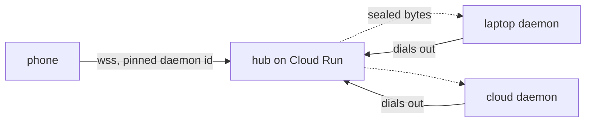

# The hub: reaching a laptop that has no address

`ompd` binds `127.0.0.1`. The laptop is behind NAT and asleep half the time, so
nothing inbound reaches it and no amount of port forwarding fixes the sleeping
half. `docs/fleet.md` argued the shape: daemons dial **out** to a relay and hold
the connection. This is that, built.

Nothing here is deployed. Deploys run in CI on this project, never from a
workstation, and the workflow has never been run.

## Shape



Three packages:

- **`@ompd/tunnel`** is the protocol, both ends of it, and it runs anywhere. No
  `node:` imports and no `Buffer`, because the phone and the browser import it
  too. Curves come from `@noble/curves` rather than WebCrypto: Bun 1.3.4 will
  generate an X25519 key and then refuse to `deriveBits` with it, and browser
  support for both curves is recent enough that a phone would need a polyfill
  regardless.
- **`@ompd/hub`** is the relay. It depends on the tunnel package for protocol
  types and signature verification, and on nothing else. It cannot execute an
  agent because it does not contain one.
- **`@ompd/daemon`** wires the tunnel to its gateway, and that wiring is nine
  lines because the decision it delegates is the whole point.

## What the hub can see

**Routing metadata, and nothing else.** Which daemon ids are enrolled, which are
connected and to which instance, how many sessions exist, how large each frame
is, and when it moved. Traffic analysis is available to it: it knows you are
talking to your laptop right now and roughly how much.

**It cannot read session content.** Prompts, transcripts, approvals, and bearer
tokens all travel sealed under AES-256-GCM, keyed by an ephemeral X25519
exchange between the client and the daemon. The hub is not a party to it.

**It cannot act as a device.** It holds public keys, never private ones, and
never a token or a token hash. There is no credential in its database to steal
and none to mint.

**A fully compromised hub can deny service and lie about who is online.** It
can also refuse to route, route you to nothing, or drop frames. What it cannot
do is decrypt or impersonate: a client pins `daemonId`, which is the full
SHA-256 of the daemon's public key, and the daemon proves possession of the
matching private half on every session. A hub that substitutes a key fails the
fingerprint check; a hub that forwards to an impostor fails the signature. Both
are tested.

**Forward secrecy holds.** Both Diffie-Hellman halves are ephemeral, so a
daemon's identity key leaking later does not open traffic captured today.

## Authentication

Two legs, two different questions.

**A daemon proves which daemon it is.** On connect the hub issues a nonce; the
daemon signs `ompd-hub-register-v1|nonce|daemonId` with its Ed25519 identity
key. The hub verifies against the **enrolled** public key, never against the key
the frame carried, because trusting the frame's own key would make registration
a matter of claiming an id and signing for yourself.

**A client proves it holds a paired, scoped, unrevoked token for that daemon.**
The hub cannot check this and deliberately holds nothing to check it with. It
verifies only that the daemon is enrolled and currently connected, then relays.
The client's bearer token travels sealed, is opened by the daemon, and goes to
`DeviceAuth.authenticate` — the same call the local websocket path makes. One
implementation, one answer, no second surface to drift.

That is also why a client paired to daemon A cannot reach daemon B: A's token
means nothing to B, and B is the one deciding.

### Every refusal is a refusal, and each is audited

| Condition | Who refuses | Code |
| --- | --- | --- |
| Daemon not enrolled | hub | `unknown_daemon` |
| Daemon enrolled but not connected | hub | `daemon_offline` |
| Registry or routing table unreachable | hub | `unverifiable` |
| Signature does not match the enrolled key | hub | `unverifiable` |
| Substituted key for a pinned id | client | `unverifiable` |
| Token never issued | daemon | `unknown_client` |
| Token or device revoked | daemon | `revoked` |
| Relay lost a frame | either | `relay_broken` |

`unknown` and `revoked` are kept apart all the way through. Collapsing them
loses the one distinction an operator needs when a phone stops working: was this
token never real, or did I withdraw it.

Enrollment takes the hub's operator credential, held by a person. An unset
credential closes the route rather than opening it.

## Cloud Run, honestly

Cloud Run works for this, with two consequences that are not optional.

**Every connection dies within 60 minutes.** A websocket is a request and Cloud
Run caps a request at 3600 seconds. Reconnection is therefore not an error path,
it is the normal operating mode, and anything that only worked on a stable
connection would be broken by the platform on a timer.

**Two legs of one session land on two instances.** Session affinity is
best-effort, which is not a correctness mechanism. So presence and cross-instance
routing live in Memorystore: a daemon's location is a **lease** that decays on
its own, because an instance killed mid-flight writes no goodbye and anything
permanent would leave a daemon looking reachable at an address that is gone.
There is no in-memory state a restart cannot rebuild, and a test runs two hub
instances over one Redis to prove a client on B reaches a daemon on A.

### Why the relay is not a durable queue

Frames are relayed, never stored. A queue would let a prompt reach a daemon
after the session that authorised it was torn down, and "a work order that runs
later when nobody is watching" is exactly the failure `docs/fleet.md` refuses.

Loss is made *detectable* instead:

- Envelopes carry a per-session sequence, and the receiver requires the next
  one. A gap tears the session down.
- A dropped **tail** frame has no later sequence to reveal it, so both legs
  report a cumulative count on a timer and a side that stays behind past the
  deadline gets torn down too.
- The backplane reports its own disconnect, because an instance whose subscriber
  died while its websockets stayed up would otherwise leave both ends looking
  connected with nothing flowing.

Every one of those ends in the same place: the session closes, the client
reconnects, and `attach { sinceSeq }` replays from the daemon's durable update
log. That log is written by the supervisor whether or not anyone is listening,
which is what makes resume possible at all.

**Known limit.** An unacknowledged client-to-daemon frame is not redelivered. A
prompt that was in flight when a session died was never accepted, and the client
is told the session broke rather than being left to assume. Automatic retry
would need an idempotency key on `prompt` so a retried turn cannot execute
twice; there is no such key today and none is invented here, because the tunnel
never retries.

## Running it

```sh
# The daemon needs a hub and an identity. The identity is created on first use
# at <home>/identity and must not be regenerated: it is what clients pinned.
ompd config set hubUrl wss://hub.example.com

# Enroll it, from a machine holding the hub's operator credential.
curl -X POST https://hub.example.com/v1/enroll \
  -H "authorization: Bearer $OMPD_HUB_OPERATOR_TOKEN" \
  -d '{"publicKey":"<from <home>/identity>","label":"laptop"}'
```

Tests, including the ones that need a real Redis:

```sh
docker run --rm -d -p 6379:6379 redis:7-alpine
OMPD_TEST_REDIS_URL=redis://127.0.0.1:6379 \
  bun test control-plane/packages/tunnel control-plane/packages/hub
```

## Corrections to `docs/fleet.md`

That document left three decisions open. Implementing settled two of them.

**"Whether the hub is content-blind" is not a trade-off.** It reads there as
something that buys simplicity if given up. It does not: the hub has to
authenticate a client somehow, and the only way it can do that itself is by
holding credentials for machines it merely relays for. Sealing the channel is
what lets the hub hold nothing, which is *less* machinery, not more. The cost
is that the hub cannot serve a UI that reads session content, and that is a
feature nobody asked for.

**"Where the hub runs" is answerable.** Cloud Run is fine, given a shared
routing table and reconnection treated as normal. The document worried that a
long-lived relay is an awkward fit for a request-scoped platform, and it is, but
the awkwardness lands entirely on connection lifetime, which the protocol had to
handle anyway for a laptop that sleeps.

**The daemon id is a fingerprint, not a name.** `fleet.md` describes enrollment
as the hub learning about a daemon. It is the other way around: the id *is* the
hash of the public key, so enrollment records a key under an id derived from it,
and the hub cannot reassign an id it did not choose.
